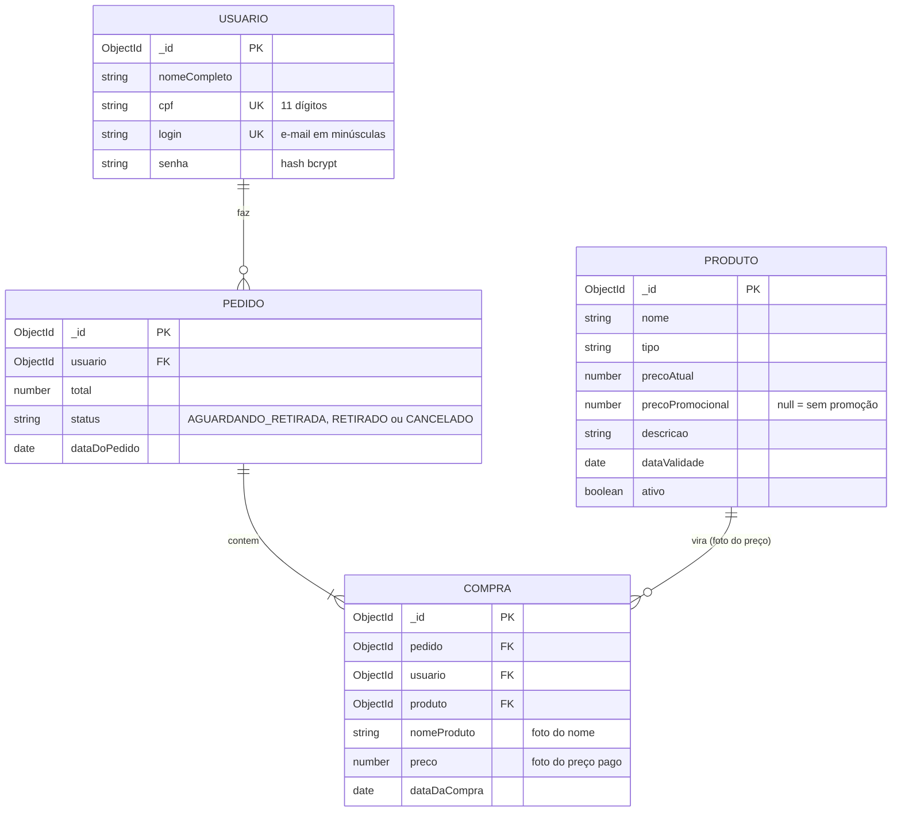

# PetMais Backend

API REST do aplicativo **PetMais** (pet shop) em **Node.js + Express + MongoDB**, com **assistente de IA rodando no Ollama**.

- App (React Native/Expo): para conectá-lo a esta API, siga [`docs/INTEGRACAO_FRONTEND.md`](docs/INTEGRACAO_FRONTEND.md); as mudanças prontas (patch e arquivos) estão em [`integracao-front/`](integracao-front/LEIA-ME.md).
- Referência de todos os endpoints: [`docs/API.md`](docs/API.md).
- IA (Ollama, Modelfile, RAG, fine-tuning): [`ia/README.md`](ia/README.md).


## Sumário

1. [Início rápido](#início-rápido)
2. [Variáveis de ambiente](#variáveis-de-ambiente)
3. [Scripts](#scripts)
4. [Modelo de dados (banco)](#modelo-de-dados-banco)
5. [Estrutura do projeto](#estrutura-do-projeto)
6. [Assistente com IA](#assistente-com-ia)
7. [Segurança](#segurança)
8. [Testes](#testes)
9. [Decisões de projeto](#decisões-de-projeto)
10. [Solução de problemas](#solução-de-problemas)
11. [Próximos passos](#próximos-passos)

## Início rápido

Requisitos: **Node.js 22+** e um MongoDB (**Atlas** na nuvem ou local via Docker). Para a IA: [Ollama](https://ollama.com/download) (opcional; sem ele o assistente responde por regras).

```bash
npm install
npm run setup          # cria o .env com JWT_SECRET e ADMIN_KEY aleatórios (não sobrescreve um .env existente)
# edite o .env: ajuste a MONGO_URL se for usar o Atlas (veja abaixo)

npm run seed           # 10 produtos + usuário de teste (idempotente: pode rodar de novo)
npm run dev            # http://localhost:3000/api/saude
npm run smoke          # (outro terminal) teste de ponta a ponta contra o servidor que está rodando
```

Usuário de teste do seed: `ana.souza@petmais.com` / `123456` (o mesmo do mock do app; **não é criado em produção**).

### MongoDB: Atlas ou local

- **Atlas**: coloque a string em `MONGO_URL`. Se ela não trouxer o nome do banco (`.../?appName=PetMais`), o backend usa `MONGO_DB` (padrão `petmais`) em vez de cair no banco `test`. No Atlas, libere o seu IP em **Network Access** e use um usuário só com acesso a este banco. Senhas com caracteres especiais (`@ : / ?`) precisam ser codificadas na URL (`@` vira `%40`).
- **Local**: `docker compose up -d mongo` e `MONGO_URL=mongodb://127.0.0.1:27017/petmais` (o banco do Docker só aceita conexões da sua máquina).

### Conectando o celular

O Expo no celular precisa alcançar o backend pela rede local. No `.env` **do app** (não deste projeto):

```
EXPO_PUBLIC_API_URL=http://192.168.1.2:3000     # IP do computador que roda o backend; sem "/api" no final
```

O app e o computador devem estar na mesma rede Wi-Fi, e o firewall precisa liberar a porta 3000 (no Windows, permita o Node.js em redes privadas). Reinicie o Expo com `npx expo start -c` depois de mudar o `.env`.

### Assistente com IA (Ollama)

```bash
npm run ia:treinar     # baixa o modelo base e cria o modelo especializado "petmais-assistente"
curl http://localhost:3000/api/assistente/status
```

Detalhes e solução de problemas em [`ia/README.md`](ia/README.md).

## Variáveis de ambiente

Validadas ao iniciar (`src/config/env.schema.js`): se algo estiver errado, o servidor explica o problema e não sobe. Variáveis desconhecidas (como `EXPO_PUBLIC_API_URL`) são ignoradas.

| Variável | Padrão | Descrição |
|---|---|---|
| `PORT` | `3000` | Porta da API |
| `MONGO_URL` | `mongodb://127.0.0.1:27017/petmais` | String de conexão (obrigatória em produção) |
| `MONGO_DB` | `petmais` | Nome do banco, usado só se a `MONGO_URL` não trouxer um |
| `JWT_SECRET` | (obrigatória) | Segredo dos tokens. Mínimo 16 caracteres (**32+ em produção**); `npm run setup` gera um bom |
| `JWT_EXPIRES_IN` | `7d` | Validade do token: número + `s`, `m`, `h` ou `d` |
| `ADMIN_KEY` | (vazia) | Chave do gerente para `/api/admin/*`. Vazia = rotas de gerente desabilitadas |
| `BCRYPT_ROUNDS` | `10` | Custo do hash de senha (4 a 15) |
| `CORS_ORIGIN` | `*` | Origens permitidas, separadas por vírgula (restrinja em produção) |
| `TRUST_PROXY` | `0` | Quantos proxies existem na frente (use `1` em Render, Railway etc.) |
| `RATE_LIMIT_MAX` | `300` | Requisições por IP a cada 15 min |
| `AUTH_RATE_LIMIT_MAX` | `20` | Tentativas de login/cadastro/chave admin por IP |
| `AI_RATE_LIMIT_MAX` | `20` | Perguntas ao assistente por IP por minuto |
| `ASSISTANT_PROVIDER` | `ollama` | `ollama` (IA com fallback para regras) ou `regras` |
| `OLLAMA_URL` | `http://127.0.0.1:11434` | Endereço do Ollama (mesma máquina do backend) |
| `OLLAMA_MODEL` | `petmais-assistente` | Modelo criado por `npm run ia:treinar` |
| `OLLAMA_TIMEOUT_MS` | `45000` | Tempo máximo esperando a IA antes de usar as regras |
| `OLLAMA_MAX_CONCURRENT` | `2` | Perguntas simultâneas à IA (as excedentes usam as regras) |

> **O `.env` guarda segredos: nunca o versione.** Ele já está no `.gitignore`. Use **um `.env` para o backend e outro, separado, para o app**: no app só cabe `EXPO_PUBLIC_API_URL`, porque qualquer variável `EXPO_PUBLIC_*` vai embutida no aplicativo e é pública.

## Scripts

| Comando | O que faz |
|---|---|
| `npm run setup` | Cria o `.env` a partir do `.env.example` com segredos aleatórios |
| `npm run dev` | Servidor com recarga automática |
| `npm start` | Servidor (produção) |
| `npm run seed` | Popula produtos e o usuário de teste (idempotente) |
| `npm run seed:reset` | **Apaga tudo** e repopula. Pede `-- --confirmo` e é proibido em produção |
| `npm run smoke` | Teste de ponta a ponta contra um servidor rodando (cria dados de teste) |
| `npm test` | Testes unitários |
| `npm run ia:treinar` | Cria o modelo `petmais-assistente` no Ollama |
| `npm run ia:dataset` | Exporta o dataset para fine-tuning LoRA |

## Modelo de dados (banco)




As três entidades do enunciado estão nas coleções `usuarios`, `produtos` e `compras`, com exatamente os atributos pedidos (`nomeCompleto/cpf/login/senha`, `nome/tipo/precoAtual/precoPromocional/descricao/dataValidade`, `nomeProduto/preco/dataDaCompra`). A coleção `pedidos` é o cabeçalho que agrupa as compras de uma mesma finalização.

| Coleção | Índices | Regras |
|---|---|---|
| `usuarios` | `cpf` único, `login` único | CPF só com dígitos (validado pelo módulo 11); login em minúsculas; `senha` guarda o **hash** bcrypt e não vem nas consultas (`select: false`) |
| `produtos` | `{ativo, tipoNormalizado}` | Preços com até 2 casas; promoção deve ser menor que o preço atual; `ativo=false` tira do catálogo sem apagar. Campos internos `nomeNormalizado`/`tipoNormalizado` (minúsculas, sem acento) sustentam a busca e são recalculados a cada `save` |
| `pedidos` | `{usuario, dataDoPedido desc}` | `status` inicia em `AGUARDANDO_RETIRADA` (pagamento no caixa, na retirada) |
| `compras` | `pedido`, `{usuario, dataDaCompra desc}` | Uma compra por produto do carrinho; guarda **foto** do nome e do preço pago (alterar o produto depois não muda o histórico) |

## Estrutura do projeto

```
src/
  server.js, app.js          Ponto de entrada e montagem do Express
  config/                    Variáveis de ambiente (validadas) e conexão com o MongoDB
  routes/                    Rotas e a cadeia de middlewares de cada uma
  controllers/               Camada fina: lê a requisição validada e devolve JSON
  services/                  Regras que falam com o banco (auth, produtos, pedidos, admin)
    ia/                      Cliente do Ollama e orquestrador do assistente (IA + fallback)
  domain/                    Regras puras, sem banco: montar pedido, assistente, RAG e prompt (domain/ia)
  models/                    Schemas Mongoose (Usuario, Produto, Pedido, Compra)
  schemas/                   Validação de entrada com zod (mensagens em português)
  middlewares/               Validação, autenticação, chave do gerente, limites e erros
  utils/                     CPF, dinheiro, preço, texto, token, senha, serializadores...
  seeds/                     Dados iniciais e script de seed
ia/                          Modelfile, dataset de exemplos e guia do Ollama
scripts/                     setup do .env, smoke test e "treino" da IA
integracao-front/            Patch e arquivos prontos para conectar o app a esta API
tests/                       Testes unitários (node:test)
docs/                        API, integração com o app e diagramas
```

Fluxo de uma requisição: `rota → limite → validação (zod) → autenticação → controller → service → model`. Erros de qualquer ponto caem num único tratador que devolve `{ codigo, mensagem, detalhes? }`.

## Assistente com IA

`POST /api/assistente/mensagens` recebe `{ mensagem, historico? }` e devolve `{ resposta, origem }`, onde `origem` é `"ia"` (Ollama) ou `"regras"` (plano B automático). A IA recebe o catálogo real do MongoDB em cada pergunta (RAG), então fala dos produtos e preços atuais sem retreino. Guia completo: [`ia/README.md`](ia/README.md).

## Segurança

- **Senhas**: bcrypt; o hash nunca sai da API. O login gasta o mesmo tempo para e-mail inexistente e senha errada (não revela quem está cadastrado) e responde sempre "Login ou senha inválidos."
- **Tokens**: JWT HS256 com algoritmo fixado na assinatura e na verificação (bloqueia `alg: none`); expira em `JWT_EXPIRES_IN`.
- **Preço nunca vem do app**: o pedido recebe só ids; o servidor calcula os valores (um app adulterado não compra por menos). Somas em centavos inteiros.
- **Isolamento**: pedido de outro usuário responde 404 (não revela que existe).
- **Entrada**: tudo validado com zod (tipos estritos: `{"$ne": null}` no login é recusado); busca por texto escapada (sem injeção de regex); corpo limitado a 100 KB.
- **Limites por IP**: geral, login (só falhas contam), cadastro, assistente e chave do gerente.
- **Cabeçalhos e CORS**: `helmet` e CORS configurável. Erros 500 nunca expõem detalhes internos.
- **LGPD**: a API não devolve o CPF completo, só a máscara (`***.982.247-**`).
- **Chave do gerente**: comparação em tempo constante; sem `ADMIN_KEY`, as rotas ficam **desabilitadas** (nunca abertas).
- **IA**: Ollama só local, sem ferramentas, texto do cliente sem os marcadores do prompt, limite de concorrência.

## Testes

```bash
npm test          # testes unitários: regras de negócio, validações, middlewares, IA, dataset
npm run smoke     # ponta a ponta contra o servidor REAL (suba com npm run dev e rode npm run seed antes)
```

O `smoke` é o teste de aceitação: cadastro, login, catálogo, busca, pedido, isolamento entre usuários, assistente e rotas de gerente. Ele **cria dados de teste** (usuários `smoke.*@petmais.test`, pedidos e um produto desativado): rode contra um banco de desenvolvimento, não contra dados reais.

Os testes unitários cobrem as regras puras (CPF, dinheiro, preço, pedido, assistente, RAG, prompt), o gerador do Modelfile, a qualidade do dataset, o cliente do Ollama (contra um servidor HTTP falso real), os schemas de validação e os middlewares.

## Decisões de projeto

Pontos que o enunciado deixa em aberto e como foram resolvidos:

1. **Carrinho no app, preço no servidor.** O carrinho é estado do app; ao finalizar, o app envia só os ids e o servidor calcula tudo.
2. **Compra = uma por produto** (sem quantidade, igual ao app: cada "Adicionar ao carrinho" é uma linha). O **Pedido** agrupa as compras da finalização e guarda o total e o status.
3. **Foto do preço e do nome** na compra: o histórico não muda se o produto mudar depois.
4. **`login` = e-mail em minúsculas** (como no app).
5. **Dinheiro** guardado como número com 2 casas (igual ao app), mas somado em centavos: por exemplo, `159.9 + 159.9 + 159.9` em JavaScript dá `479.70000000000005`, e o backend devolve `479.7`.
6. **Busca** sem diferenciar acento e maiúscula, em nome **ou** tipo (igual à do app).
7. **Validade é informativa**: não bloqueia a venda. Bloquear produtos vencidos exigiria uma regra de negócio que o enunciado não define, e faria produtos do seed "sumirem" sozinhos quando a data passasse. É uma mudança de uma linha se o professor pedir. As datas trafegam como `AAAA-MM-DD`.
8. **Pagamento fora do app**: o pedido nasce `AGUARDANDO_RETIRADA`.
9. **Sem transações do MongoDB** (funciona em Mongo local simples e no Atlas): as compras são gravadas primeiro e o pedido por último; se algo falhar no meio, o que já foi gravado é desfeito (nenhuma compra "órfã").
10. **Gerente**: sem perfis de usuário, `ADMIN_KEY` num header protege o cadastro e a edição de produtos. É a opção mais simples; um papel `gerente` no usuário seria a evolução natural.
11. **Sessão sem refresh token**: o app guarda o token em memória; ao expirar, o usuário entra de novo.

## Solução de problemas

| Sintoma | O que fazer |
|---|---|
| `[config] Variáveis de ambiente inválidas` | Leia a lista; rode `npm run setup` ou ajuste o `.env` |
| `falha ao iniciar: ... ServerSelection / whitelist` | Atlas: libere seu IP em *Network Access*; confira a `MONGO_URL` |
| `bad auth` | Usuário/senha do Atlas errados; senha com caracteres especiais precisa ser codificada na URL |
| Dados foram para o banco `test` | A `MONGO_URL` não tem nome de banco: defina `MONGO_DB` ou use `.../petmais?...` |
| Celular não conecta | Mesma rede Wi-Fi; firewall liberando a porta 3000; `EXPO_PUBLIC_API_URL` com o IP certo (sem `/api`); `npx expo start -c` |
| `401 TOKEN_EXPIRADO` | Faça login de novo |
| `429 MUITAS_REQUISICOES` | Aguarde a janela (15 min no login) ou aumente os limites no `.env` |
| Assistente sempre `origem: "regras"` | `GET /api/assistente/status` e o log `[ia]` (traz a dica); veja [`ia/README.md`](ia/README.md) |

## Próximos passos

- Rotas de gerente para listar pedidos e marcar como `RETIRADO`/`CANCELADO`.
- Papel `gerente` no usuário (em vez de chave única) e recuperação de senha.
- `expo-secure-store` no app para manter a sessão entre aberturas.
- Streaming das respostas da IA e embeddings (`nomic-embed-text`) se o catálogo passar de centenas de produtos.
- Fine-tuning LoRA com um dataset maior (veja `ia/README.md`).
- Testes de integração com `mongodb-memory-server`, OpenAPI/Swagger e deploy com HTTPS.
